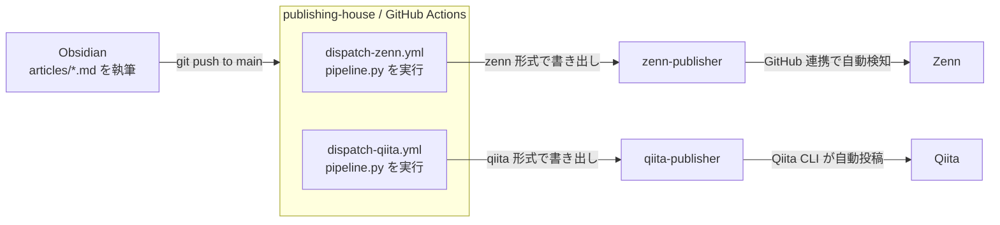

:::message
**Key Points**
- `publishing-house` リポジトリを Single Source of Truth として、Zenn・Qiita へ自動配信するシステムを構築した
- 画像は Cloudflare R2 で管理し、git には含めない。pipeline が配信時に R2 URL へ自動変換する
- Obsidian を CMS として使い、Templater テンプレートで記事を作成する
:::

# はじめに
QiitaとZennに自動で記事を投稿・更新するシステムを構築しました。

Zenn と Qiita はそれぞれ独自の記法・フロントマター・配信方式を持っており、両方に対して記事を管理し続けるのはコストがかかります。この記事では、単一の Markdown ファイルを Single Source of Truth として、両プラットフォームへ自動配信するアーキテクチャと設計の考え方を紹介します。

---
# アーキテクチャ

3つのリポジトリを役割で分離しています。
- `publishing-house` — 執筆・管理用。Single Source of Truth
- `qiita-publisher` — Qiita CLI が監視するリポジトリ
- `zenn-publisher` — Zenn の GitHub 連携先リポジトリ


`articles/` への push で GitHub Actions が起動し、`pipeline.py` が各プラットフォーム向けに変換したファイルをそれぞれのリポジトリへ push します。

---
# Obsidian を CMS として使う
:::message
**Obsidianの良さ**
Obsidianはローカル管理されているためClaude Codeなどのコーディングエージェントとの相性がよいため、推敲するのに非常に便利。
さあみんなでObsidianを使ってサクサク書いていきましょう。
:::

Obsidian の Templater プラグインを使って記事を作成します。テンプレート実行時に Title と Tags の入力を求め、フロントマターを自動生成します。

```
1. Obsidian でテンプレートを実行 → Title と Tags を入力
2. articles/ に Markdown ファイルが生成される
3. 本文を書く（status: draft のまま）
4. 画像を貼り付ける（ として挿入）
5. make upload-images で画像を R2 へアップロード
6. status を ready に変更
7. git push → GitHub Actions が自動配信
```
執筆から公開まで、Git の操作以外は Obsidian の中で完結します。

---
# なぜリポジトリを分けるのか

Zenn と Qiita はどちらも「特定リポジトリのファイル構造を監視する」という仕組みで動いています。両者は互換性がなく、同一リポジトリで同時に対応することは難しいです。

そのため、執筆用の `publishing-house` を中心に置き、各プラットフォームのルールに合わせた変換済みファイルをそれぞれの専用リポジトリへ書き出すという設計を採用しました。

dispatch スクリプトの処理フローは以下の通りです。

```mermaid
flowchart TD
  PUSH["git push to main<br>articles/ に変更あり"] --> TRIG["GitHub Actions 起動"]
  TRIG --> CLONE["対象リポジトリを一時ディレクトリへ clone<br>zenn-publisher または qiita-publisher"]
  CLONE --> READ["articles/*.md を順次読み込み"]
  READ --> CHK{"status: draft?<br>または platforms 対象外?"}
  CHK -->|Yes| SKIP["スキップ"]
  CHK -->|No| FM["フロントマター変換<br>status → published / private<br>zenn_emoji → emoji<br>tags → topics / tags"]
  FM --> CB["Callout 変換<br>&#91;!tip&#93; → :::message (Zenn)<br>&#91;!tip&#93; → :::note info (Qiita)"]
  CB --> IMG["画像 URL 変換<br>!&#91;&#91;img.png&#93;&#93; → R2 URL"]
  IMG --> WRITE["変換済みファイルを clone 済みリポジトリへ書き出し"]
  WRITE --> DIFF{"git diff<br>差分あり?"}
  DIFF -->|Yes| COMMIT["git commit && push"]
  DIFF -->|No| END["何もしない"]
  COMMIT --> DEST["zenn-publisher / qiita-publisher<br>→ プラットフォームが自動配信"]
```




# フロントマター変換

Zenn と Qiita はフロントマターのスキーマが異なります。`publishing-house` 側では独自スキーマで管理し、pipeline が変換します。

## publishing-house のフロントマター

```yaml
---
title: "記事タイトル"
tags:
  - TypeScript
  - React
platforms:
  zenn: true    # Zenn へ配信するか
  qiita: true   # Qiita へ配信するか
status: draft   # draft / ready / published
zenn_emoji: "📝"
zenn_type: tech
published_at: 2026-05-04 10:00  # 任意：スケジュール投稿
---
```

## `status` の挙動

| 値 | Zenn | Qiita |
|---|---|---|
| `draft` | `published: false` | `private: true` |
| `ready` / `published` | `published: true` | `private: false` |

## プラットフォームの選択

```yaml
platforms:
  zenn: true
  qiita: false   # Qiita には配信しない
```

`platforms` で配信先を制御できます。`status: draft` のファイルはプラットフォームに関わらず配信されません。


# Callout 変換

Obsidian の callout 記法をそれぞれのプラットフォーム向けに変換します。

```markdown
# publishing-house（Obsidian callout）
:::message
**ポイント**
覚えておくべき内容
:::

# zenn-publisher に変換
:::message
**ポイント**
覚えておくべき内容
:::

# qiita-publisher に変換
:::note info
**ポイント**
覚えておくべき内容
:::
```

---

# 画像管理（Cloudflare R2）

## なぜ git で管理しないか

:::message
**リポジトリの肥大化を避けたい**
GitHubではリポジトリ制限は1GBまでを推奨している
Qiitaでは画像のアップロードAPIがないため、手動アップロードが必要になる
:::

バイナリファイルをリポジトリに含めると肥大化します。また Zenn はリポジトリから画像ファイルを読みますが、`zenn-publisher` に画像を push する仕組みを作ると複雑度が増します。

Qiita は外部 URL の画像しか参照できないため、どちらにせよ外部ストレージが必要です。

そこで両プラットフォームを外部 URL で統一することにしました。Cloudflare R2 に画像をアップロードし、記事中では R2 の公開 URL を使います。

## 執筆時の記法
Obsidian で画像を貼り付けると wiki リンク形式で挿入されます。
```markdown

```
このまま執筆し、pipeline が変換時に R2 URL へ置き換えます。

```markdown

```
変換は `publishing-house` 側で実行されるため、`zenn-publisher` / `qiita-publisher` には最初から R2 URL が書かれた状態のファイルが届きます。


# 関連記事

- [Zenn CLI と GitHub 連携の導入手順](zenn-auto-publish)
- [Qiita CLI の導入手順と記法](qiita-auto-publish)
