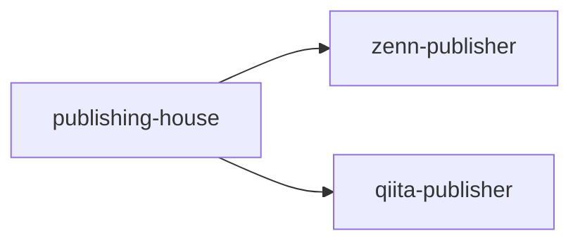

:::message
**Key Points**
- Qiitaに自動で記事をアップロードする方法には `Qiita-CLI`が存在する
- npxでの実行がメイン
- GitHub Actionsで `qiita-publisher` リポジトリへ自動 push することで投稿・更新を自動化できる
:::

# はじめに
Qiitaの執筆を行う際に、ローカルで書いて、それをGitHubリポジトリで管理して、そこからQiitaに自動で投稿・更新したい！！！と強く思ったため、Qiita-CLIを導入してみました。

---
## Phase1: Install - Qiita-CLIの導入
インストールは以下の公式リンクを参照
- [Qiitaの記事をGitHubリポジトリで管理する方法 - Qiita](https://qiita.com/Qiita/items/32c79014509987541130)

### STEP1: リポジトリの作成
GitHubでリポジトリを作成します。ここでは `qiita-publisher` とします。
Publicにすることを推奨します。

### STEP2: QiitaトークンをGitHub Actions/Secretsに登録

#### 2-1. Qiitaの個人用アクセストークンを発行する
Qiitaの[設定](https://qiita.com/settings/tokens/new?read_qiita=1&write_qiita=1&description=qiita-cli) にある`アプリケーション > 新しくトークンを発行する` から個人用アクセストークンを発行します。 すでに発行されているトークンを使う場合は不要です。

発行の際のパラメータ
- アクセストークンの説明: `auto-publisher`
- スコープ: `read_qiita, write_qiita`


アクセストークンを発行したら、文字列をコピーしてください。
発行したアクセストークンは、`Qiita CLIのログイン`と`GitHub ActionsのSecrets`の設定で使います。  
そのため、発行したアクセストークンは、忘れずに保存しておいてください。

#### 2-2. GitHub ActionsのSecretsに登録
対象リポジトリの `Settings > Secrets and variables > Actions > New repojitory secrets` から設定

### STEP3: Qiita CLIのセットアップ
クライアント端末で、Qiita CLIのセットアップをします。
セットアップをすると、Qiitaの記事をGitHubリポジトリ(ここでは qiita-publisher)で管理するためのActionsのワークフローファイルが生成されます。
- 詳細は[Qiita CLI README - GitHub](https://github.com/increments/qiita-cli)で確認してください。

#### 3-1. Node.jsのバージョン確認
Qiita CLI を使うには `Node.js 20.0.0` 以上が必要です。 Node.js をはじめて使う場合はインストールする必要があります。

#### 3-2. Qiita CLI をインストールする
:::message alert
Qiita公式で提供している Qiita CLI の npm package 名は **@qiita/qiita-cli** となります。 その他は異なるパッケージがインストールされてしまいます。必ずご確認の上、インストールしてください。
:::

作成したレポジトリで、以下のコマンドを実行し、結果を確認します。
```bash
% npm install @qiita/qiita-cli --save-dev

added 110 packages in 3s

47 packages are looking for funding
  run `npm fund` for details
```
作成されると、npmのpackageが追加されます。
```bash
% ls

node_modules            package-lock.json       package.json            README.md
```
以下のコマンドでバージョンが表示されればインストール完了です。
```bash
% npx qiita version

1.8.0
```

### STEP4: レポジトリの初期設定

#### 4-1. initコマンドを実行
```bash
% npx qiita init

Success! ✨

次のステップ:

  1. トークンを作成してログインをしてください。
    npx qiita login

  2. 記事のプレビューができるようになります。
    npx qiita preview
```

#### 4-2. Qiitaのトークンを設定
先ほど発行したトークンを使ってloginをします。
```bash
% npx qiita login

Hi {{ ユーザー名 }}!
ログインが完了しました 🎉
以下のコマンドを使って執筆を始めましょう！

🚀 コンテンツをブラウザでプレビューする
  npx qiita preview

🚀 新しい記事を追加する
  npx qiita new (記事のファイルのベース名)

🚀 記事を投稿、更新する
  npx qiita publish (記事のファイルのベース名)

💁 コマンドのヘルプを確認する
  npx qiita help
```
トークンによってQiitaのアカウントとの紐付けが完了します。

---

## Phase2: Usage - 実際に使ってみる
### フロントマター仕様

qiita-cli が認識するフロントマターのフィールド一覧です。

| フィールド | 型 | 説明 |
|---|---|---|
| `title` | string | 記事タイトル |
| `tags` | list | タグ（plain string のリスト） |
| `private` | bool | `false` で公開、`true` で限定共有 |
| `updated_at` | string | 最終更新日時（ISO 8601） |
| `id` | string \| null | 記事 ID。初回は `null`、投稿後に自動セットされる |
| `organization_url_name` | string \| null | Organization の URL 名 |
| `slide` | bool | スライドモードの有効化 |
| `ignorePublish` | bool | `true` にすると CI でスキップされる |

実際のファイルは以下のようになります：

```yaml
---
title: "記事タイトル"
tags:
  - Python
  - GitHub Actions
private: false
updated_at: '2026-05-04T10:00:00+09:00'
id: abc123def456
organization_url_name: null
slide: false
ignorePublish: false
---
```

#### `id` の扱い

`id: null` のまま push すると **新規投稿** として扱われ、Qiita CLI が採番した ID をファイルに書き戻します。

以後同じファイルを push すると `id` が一致する既存記事が**更新**されます。

### Callout 変換

Obsidian の callout 記法を Qiita に投稿する際は、`:::note` 記法に変換する必要があります。

| Obsidian callout | Qiita 記法 |
|---|---|
| `[!note]` `[!tip]` `[!info]` `[!hint]` `[!question]` `[!example]` `[!quote]` | `:::note info` |
| `[!warning]` `[!caution]` `[!attention]` | `:::note warn` |
| `[!danger]` `[!error]` `[!bug]` `[!failure]` | `:::note alert` |

変換例：

```markdown
# Before（Obsidian callout）
:::message
**ポイント**
- 覚えておくべきこと
- もう一つの点
:::

# After（Qiita 記法）
:::note info
**ポイント**
- 覚えておくべきこと
- もう一つの点
:::
```

タイトルなし callout も対応しています：

```markdown
# Before
:::message alert
npm パッケージ名を必ず確認してください。
:::

# After
:::note warn
npm パッケージ名を必ず確認してください。
:::
```


### 使える記法

QiitaのMarkdownで使える主な記法は以下の通りです。

#### コードブロック
言語名を指定してシンタックスハイライトが有効になります。

````markdown
```python
def hello():
    print("Hello, Qiita!")
```
````

#### 数式（KaTeX）
インライン数式と独立した数式ブロックを使用できます。

```markdown
インライン: $E = mc^2$

ブロック:
$$
\sum_{i=1}^{n} x_i = \frac{n(n+1)}{2}
$$
```

#### Mermaid ダイアグラム
コードブロックの言語に `mermaid` を指定します。

````markdown

````

#### テーブル

```markdown
| ヘッダー1 | ヘッダー2 |
|---|---|
| 値1 | 値2 |
```

#### 外部リンクの埋め込み
URLを単独行に書くとカード形式で表示されます。

```markdown
https://qiita.com/Qiita/items/c686397e4a0f4f11683d
```


### 画像の扱い（R2）

Qiita は外部 URL の画像を表示できます。今回は画像を git 管理せず、Cloudflare R2 に保存して URL で参照します。

#### 執筆時

Obsidian に画像を貼り付けると以下の形式で挿入されます。

```markdown

```

このまま執筆を続けます。

#### 公開前の作業

```bash
# R2 に画像をアップロードしてから push する
git add public/your-article.md
git commit -m "publish: your-article"
git push
```

#### 変換後

Obsidian の `` 記法を R2 URL を使った標準 Markdown 記法に変換します。

```markdown

```


## Sources

- [Qiitaの記事をGitHubリポジトリで管理する方法 - Qiita](https://qiita.com/Qiita/items/32c79014509987541130)
- [Qiita CLI README - GitHub](https://github.com/increments/qiita-cli)
- [Qiita Markdown チートシート](https://qiita.com/Qiita/items/c686397e4a0f4f11683d)
