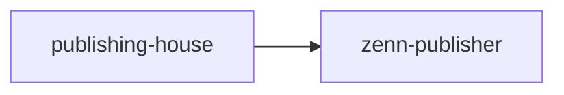

:::message
**Key Points**
- ZennはGitHub連携機能によって記事の自動投稿・更新を実現することができる
- npxでの実行も可能となる
- しかし、公式が推奨しているのはGitHub連携機能であるため、そちらの利用を推奨する
:::


# Phase1: Installation - Zenn CLI/GitHub連携機能の導入

以下の公式記事を参考にしてGitHubに適用していきます。今回はZenn専用レポジトリ `zenn-publisher` を作成しました。

https://zenn.dev/zenn/articles/connect-to-github

https://zenn.dev/zenn/articles/install-zenn-cli

https://github.com/zenn-dev/zenn-editor

## STEP1: リポジトリの作成

GitHubで記事用のリポジトリを作成します。
ここでは以下のように設定しました。
- name: `zenn-publisher`
- visibility: `public`

## STEP2: CLIのインストール

```shell
$ npm init --yes

{
  "name": "zenn-publisher",
  "version": "1.0.0",
...
}

$ npm install zenn-cli

10 packages are looking for funding
  run `npm fund` for details

found 0 vulnerabilities
```

## STEP3: Zenn用のセットアップ

```shell
$ npx zenn init

Generating README.md skipped.

  🎉  Done!
  早速コンテンツを作成しましょう

  👇  新しい記事を作成する
  $ npx zenn new:article

  👇  新しい本を作成する
  $ npx zenn new:book

  👇  投稿をプレビューする
  $ npx zenn preview
```

## STEP4: Zenn画面でのGitHub連携
`右上のアカウントマークをクリック > GitHubからのデプロイ` で連携画面へ遷移する。

ここでGitHubの自分のリポジトリを選択すると連携機能を設定できる。


# Phase2: Usage - 実際に使ってみる

## STEP1: Articleの執筆
いつも通りにMarkdownを書いてみる。

Zenn が認識する Article のフロントマターは以下の通りです。

### フロントマター仕様

| フィールド | 型 | 説明 |
|---|---|---|
| `title` | string | 記事タイトル |
| `emoji` | string | サムネイル絵文字（1文字） |
| `type` | string | `tech`（技術記事）または `idea` |
| `topics` | list | タグ（最大5件） |
| `published` | bool | `true` で公開、`false` で下書き |
| `published_at` | string | スケジュール投稿・バックデート（任意） |

実際のファイルは以下のようになります：

```yaml
---
title: "記事タイトル"
emoji: "🚀"
type: tech
topics:
  - python
  - githubactions
published: true
published_at: 2026-05-04 10:00
---
```

#### `published_at` の使い方

- **スケジュール投稿**: 未来の日時を指定すると、その時刻まで非公開になります
- **バックデート**: 過去の日時を指定すると、作成日として表示されます
- **省略**: `published_at` を指定しない場合は push した時点が公開日時になります


### Callout 変換

Obsidian の callout 記法を Zenn に投稿する際は、`:::message` 記法に変換する必要があります。

| Obsidian callout | Zenn 記法 |
|---|---|
| `[!note]` `[!info]` `[!tip]` `[!hint]` `[!abstract]` `[!question]` `[!example]` `[!quote]` | `:::message` |
| `[!warning]` `[!caution]` `[!attention]` `[!danger]` `[!error]` `[!bug]` `[!failure]` | `:::message alert` |

変換例：

```markdown
# Before（Obsidian callout）
:::message
**ポイント**
- 覚えておくべきこと
- もう一つの点
:::

# After（Zenn 記法）
:::message
**ポイント**
- 覚えておくべきこと
- もう一つの点
:::
```

警告系 callout の変換例：

```markdown
# Before
:::message alert
**注意**
この操作は元に戻せません。
:::

# After
:::message alert
**注意**
この操作は元に戻せません。
:::
```


### 使える記法

Zenn が対応する主な記法は以下の通りです。

#### コードブロック
言語名とファイル名を指定できます。

````markdown
```python:hello.py
def hello():
    print("Hello, Zenn!")
```
````

#### メッセージブロック（Zenn 独自）

```markdown
:::message
情報メッセージ
:::

:::message alert
警告メッセージ
:::
```

#### アコーディオン（details）

```markdown
:::details 詳細を見る
折りたたまれた内容
:::
```

#### 数式（KaTeX）

```markdown
インライン: $E = mc^2$

ブロック:
$$
\sum_{i=1}^{n} x_i
$$
```

#### Mermaid ダイアグラム

````markdown

````

#### 外部リンクの埋め込み
URL を単独行に書くとカード形式で表示されます。

```markdown
https://zenn.dev/zenn/articles/connect-to-github
```


### 画像の扱い（R2）

Zenn は git リポジトリから直接画像ファイルを読み込みます。また、**Cloudflare R2 などの外部 URL で画像を参照する**こともできます。

#### 執筆時

Obsidian に画像を貼り付けると以下の形式で挿入されます。

```markdown

```

このまま執筆を続けます。

#### 公開前の作業

```bash
# R2 に画像をアップロードしてから push する
git add articles/your-article.md
git commit -m "publish: your-article"
git push
```

#### 変換後

Obsidian の `` 記法を R2 URL を使った標準 Markdown 記法に変換します。

```markdown

```

R2 URL に変換することで、Zenn 側で画像が正常に表示されます。


# 関連記事

- [Zenn + GitHub 連携で記事管理 - Zenn](https://zenn.dev/zenn/articles/connect-to-github)
- [Zenn CLI で記事を管理 - Zenn](https://zenn.dev/zenn/articles/install-zenn-cli)
